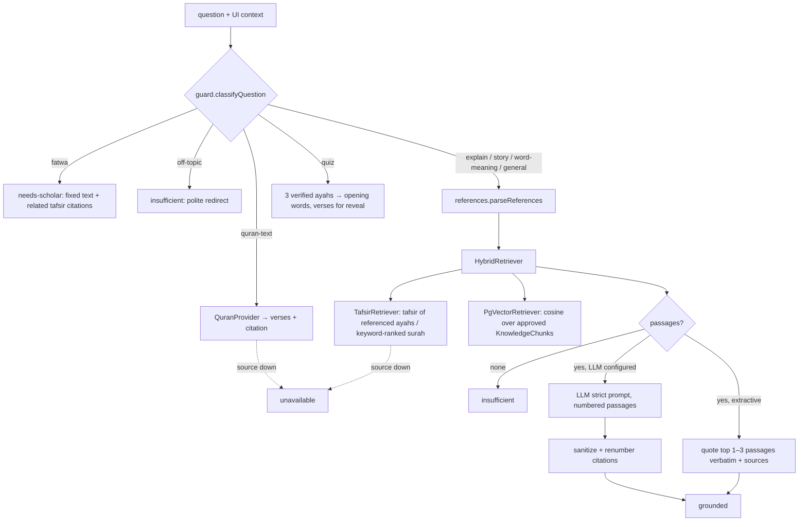

# مُدّكِر — Backend Architecture

Server side of the Next.js 15 app: route handlers under `src/app/api/v1/**`, domain
modules under `src/server/**`, Prisma schema in `prisma/schema.prisma`, CLI jobs in
`scripts/`. Everything framework-specific stays in the route files; `src/server` uses
the standard Fetch API so the same modules can back a future mobile API/BFF.

```
src/server/
  env.ts errors.ts http.ts rate-limit.ts db.ts validation.ts
  quran/      provider.ts (factory) · common.ts · quran-com.ts · database.ts · json-cache.ts · verification.ts
  stt/        provider.ts (registry) · openai.ts · mock.ts · mime.ts
  llm/        provider.ts (LLM + embeddings) · anthropic.ts · openai.ts
  rag/        sources.ts · references.ts · guard.ts · retriever.ts · prompt.ts · sanitize.ts · quiz.ts · chunk.ts · assistant.ts
  notifications/ channel.ts · in-app.ts · web-push.ts · mobile.ts (stub) · schedule.ts · service.ts
  auth/       password.ts · session.ts · guards.ts · index.ts
  user/       schema.ts · state-store.ts · account.ts · mappers.ts
  recordings/ store.ts
```

**Non-negotiables enforced in code**

| Rule | Where |
|---|---|
| Quran text only from a verified source, never from code/LLM | `QuranProvider` + `verification.ts`; `sanitize.ts` strips verse-like output |
| Tafsir only from approved sources | `rag/sources.ts` registry; retrievers filter on `approved` |
| Fatwa → fixed "needs-scholar" text | `rag/guard.ts` runs before retrieval/LLM |
| Text matching only, no tajweed claims | `RecitationAnalysis.textOnly: true`; prompt rule 7 |
| Keys server-only; audio not kept by default | `env.ts` (no `NEXT_PUBLIC_` secrets); `recordings/store.ts` |

---

## 1. Database schema

PostgreSQL 15+ with the `vector` extension (pgvector), Prisma 6 with
`previewFeatures = ["postgresqlExtensions"]`. All user-owned tables cascade on
`User` delete, so account deletion is one `DELETE` (plus audio files, see §4).
Hyphenated app enum values (`needs-review`, `juz-amma`) are stored with `_`
(`user/mappers.ts`).

```mermaid
erDiagram
  User ||--o| UserProfile : has
  User ||--o{ Session : has
  User ||--o| UserStateSnapshot : syncs
  User ||--o{ MemorizationGoal : sets
  User ||--o{ MemorizationProgress : "per ayah"
  User ||--o| ResumePoint : "continues at"
  User ||--o{ MemorizationSession : logs
  User ||--o{ RecitationSession : records
  RecitationSession ||--o{ RecitationResult : "per ayah"
  RecitationSession ||--o{ RecitationMistake : has
  User ||--o{ ReviewSchedule : due
  ReviewSchedule ||--o{ ReviewAttempt : attempts
  User ||--o{ ReviewAttempt : makes
  User ||--o{ ChatConversation : asks
  ChatConversation ||--o{ ChatMessage : contains
  ChatMessage ||--o{ Citation : cites
  User ||--o| NotificationPreference : prefers
  User ||--o{ Notification : receives
  User ||--o{ PushSubscription : devices
  User ||--o{ Bookmark : saves
  User ||--o{ DailyActivity : "per day"
  Surah ||--o{ Ayah : contains
  Story ||--o{ StoryChapter : has
  Story ||--o{ StoryAyahReference : references
  StoryChapter ||--o{ StoryAyahReference : references
  Story ||--o{ Video : features
  TafsirSource ||--o{ TafsirEntry : contains
  KnowledgeSource ||--o{ KnowledgeChunk : "embedded chunks"
```



| Group | Models | Notes |
|---|---|---|
| Identity | `User`, `UserProfile`, `Session` | scrypt hash; server-side sessions (revocable); `UserProfile.timeZone` for reminders; `keepRecordings` opt-in |
| Sync | `UserStateSnapshot` (jsonb) | the client's whole `UserState` (see below) |
| Quran | `Surah`, `Ayah` | imported + verified; `checksum` (sha256) per ayah and per surah; `sourceId` = `quran-com:uthmani` / `tanzil:uthmani`; unique `(surahNumber, number)`, `key`, `globalIndex` |
| Memorization | `MemorizationGoal`, `MemorizationProgress`, `ResumePoint`, `MemorizationSession` | progress unique `(userId, surah, ayah)`, index `(userId, nextReviewAt)` |
| Recitation | `RecitationSession`, `RecitationResult`, `RecitationMistake` | `audioStorageKey`/`audioExpiresAt` nullable — set only for opted-in retention; index on `audioExpiresAt` for purge |
| Review | `ReviewSchedule`, `ReviewAttempt` | server-side queue for future mobile/analytics |
| Content | `Story`, `StoryChapter`, `StoryAyahReference`, `Video` | ayah references are numbers only |
| Knowledge | `TafsirSource`, `TafsirEntry`, `KnowledgeSource`, `KnowledgeChunk` | `approved` flags; `embedding vector(1536)`; HNSW cosine index created by `kb:index` |
| Assistant | `ChatConversation`, `ChatMessage`, `Citation` | saved for signed-in users only |
| Notifications | `NotificationPreference`, `Notification`, `PushSubscription` | `Notification` unique `(userId, dedupeKey)` makes the cron idempotent |
| Misc | `Bookmark`, `DailyActivity` | |

**`/me/state` persistence — decision.** The client is offline-first and syncs one
`UserState` document. `PUT /me/state` validates it (zod), stores it verbatim in
`UserStateSnapshot` (source of truth for `GET`, lossless, tolerant of new UI fields),
and in the **same transaction** projects it into `UserProfile`,
`MemorizationProgress`, `ResumePoint`, `DailyActivity`, `Bookmark`,
`MemorizationGoal`, `NotificationPreference`. The relational copy powers the
reminder cron, analytics and future granular endpoints. Last write wins (single
user, few devices); add a `version`/`updatedAt` precondition if multi-device
conflicts become real.

Setup:

```bash
npx prisma migrate dev          # creates tables + CREATE EXTENSION vector
npm run db:seed:quran           # Quran.com → verify → DB   (or --tanzil file.txt)
npm run db:seed:tafsir          # التفسير الميسر (add -- --source all for Ibn Kathir)
npm run db:seed:demo            # stories/videos from src/content (if present)
npm run kb:index                # embeddings → KnowledgeChunk (+ HNSW index)
npm run quran:cache             # optional: data/quran/*.json for QURAN_PROVIDER=json
```

---

## 2. REST API (`/api/v1`)

All responses are JSON. Every error is `{ "error": "<Arabic, user-facing>", "code": "<stable id>" }`.
Auth = signed `mz_session` cookie (httpOnly). "opt" = works signed out; signed-in
users additionally get history saved.

| Method | Path | Auth | Request | Response |
|---|---|---|---|---|
| GET | `/quran/surahs` | – | – | `SurahMeta[]` |
| GET | `/quran/surahs/{n}` | – | – | `SurahText` (cacheable) |
| GET | `/quran/surahs/{n}/tafsir?source=muyassar\|ibn-kathir` | – | – | `{ entries: TafsirEntry[], source: SourceRef }` |
| POST | `/recitation/transcribe` | opt | multipart `audio` (≤ 15 MB, audio/* allowlist), `range` (JSON `AyahRange`, ≤ 30 ayahs) | `Transcript` |
| POST | `/recitation/analyze` | opt | `{ range, transcript }` | `RecitationAnalysis` (server loads expected ayahs) |
| POST | `/assistant/ask` | opt | `{ question ≤ 1000, context?: { surah?, ayah?, storySlug? } }` | `AssistantAnswer` |
| POST | `/notifications/subscribe` | ✓ | `{ subscription: PushSubscriptionJSON }` or `{ platform: "fcm"\|"apns", token }` | `{ ok: true }` |
| DELETE | `/notifications/subscribe` | ✓ | `{ endpoint }` | `{ ok: true }` |
| GET | `/notifications/preferences` | ✓ | – | `NotificationPreferences & { timeZone }` |
| PUT | `/notifications/preferences` | ✓ | `NotificationPreferences & { timeZone? }` | same as GET |
| GET/POST | `/cron/reminders` | Bearer `CRON_SECRET` | – | `{ ok, reminders: SweepStats, recordingsPurged, sessionsPurged }` |
| POST | `/auth/register` | – | `{ email, password ≥ 8, name? }` | `201 { user: { id, email } }` + cookie |
| POST | `/auth/login` | – | `{ email, password }` | `{ user }` + cookie |
| POST | `/auth/logout` | – | – | `{ ok: true }`, cookie cleared |
| GET | `/me` | ✓ | – | `{ user: { id, email, createdAt }, profile }` |
| DELETE | `/me` | ✓ | – | `{ ok: true }` — account + all data deleted |
| GET | `/me/state` | ✓ | – | `UserState` |
| PUT | `/me/state` | ✓ | `UserState` (optional header `x-time-zone`) | `{ ok: true, savedAt }` |
| DELETE | `/me/state` | ✓ | – | `{ ok: true }` (progress cleared, account kept) |

Error codes: `invalid_request` 400 · `range_too_large` 400 · `unauthorized` 401 ·
`invalid_credentials` 401 · `forbidden` 403 (cross-origin mutation) · `not_found` 404 ·
`email_taken` 409 · `payload_too_large` 413 · `unsupported_media_type` 415 ·
`rate_limited` 429 (+ `Retry-After`) · `internal` 500 · `provider_error` 502 ·
`quran_verification_failed` 502 · `stt_unavailable` 502/503 ·
`quran_source_unavailable` 503 · `no_database` 503 (client falls back to device-only
accounts) · `push_not_configured` 503.

Rate limits (per user when signed in, else per IP): transcribe 20/10 min,
analyze 60/10 min, assistant 20/5 min, auth 10/15 min (login also per email).

---

## 3. AI / RAG architecture



**Pipeline** (`rag/assistant.ts`, dependencies injectable for tests):

1. **Guard** (`guard.ts`, pure rules, runs first so safety never depends on a model).
   Fatwa = strong personal-ruling framings (`هل يجوز`, `ما حكم`, `هل علي`, `فتوى`…) or
   fiqh topics (`حلال/حرام`, `طلاق`, `ميراث`, `زكاة`, `كفارة`…) *unless* the question is
   explanatory about a text (`ما معنى`, `تفسير`, `اشرح`, `آيات …`). Tajweed "rules"
   (`حكم الإدغام`) are not fiqh. Reply text is exactly
   `هذا السؤال يحتاج إلى فتوى من جهة علمية موثوقة، ويمكنني مساعدتك في فهم النصوص والمصادر المرتبطة به.`
2. **References** (`references.ts`, pure): all 114 names + alternates, `سورة` optional,
   `ال` dropped after `سورة`, hamza/ta-marbuta variants, clitics, Arabic-Indic digits,
   `الآية ٣٢`, `الآيات 1-5`, `من … إلى`, ordinals, `19:32`; ambiguous common-word names
   (`الناس`, `النور`, `الطلاق`…) need `سورة` or a number; UI context fills gaps.
3. **Retrieve** approved passages (≤ 6). Direct ayah hits score 1.0.
4. **Generate** (LLM) with `SYSTEM_PROMPT`: answer only from numbered passages, cite `[n]`,
   never write verses or use `﴿ ﴾`, no rulings, editorial intros are not tafsir, reply
   `INSUFFICIENT` when unsure → `kind: "insufficient"`. Temperature 0.2, ≤ 700 tokens.
   LLM outage → automatic extractive fallback.
5. **Sanitize** (`sanitize.ts`): removes `﴿…﴾`, text with Quranic annotation marks
   (U+06D6–06ED, U+0671, U+0670), quotes that look like verses (fully vocalised, or
   introduced by `قال تعالى`), and any ≥ 5-word run matching a verified verse in context.
   Citations are renumbered to the passages actually cited.
6. **Verses**: for referenced ranges ≤ 5 ayahs, `verses` are attached from the provider —
   the UI renders verse text only from this field.

`AnswerKind` usage: `grounded` · `insufficient` (no evidence, sentinel, off-topic, missing
ref) · `needs-scholar` · `quran-text` (verse display **and quizzes**) · `unavailable`.

**Providers.** `LLM_PROVIDER = anthropic | openai | extractive` (`getLlmProvider()` returns
`null` for extractive or a missing key). `EmbeddingProvider` = OpenAI
`text-embedding-3-small`, 1536 dims (must match `vector(1536)`). Vendors are isolated in
`llm/anthropic.ts` / `llm/openai.ts`; adding one = implement `LLMProvider.complete()`.

**Adding a knowledge source.**
1. Add an entry to `KNOWLEDGE_SOURCES` in `rag/sources.ts` (`approved: false` first).
2. Write an importer storing its text as `TafsirEntry` (ayah-keyed) or directly as
   `KnowledgeChunk` rows with that `sourceId` (see `scripts/import-tafsir.ts`).
3. Have the content reviewed by a qualified editor; set `approved: true`.
4. `npm run kb:index -- --source <id>` to embed. Retrieval picks it up automatically;
   unapproved sources are filtered in SQL *and* in code.
Editorial content must set `editorial: true` so it is labelled "مقدمة تحريرية (ليست تفسيرًا)".

---

## 4. Speech pipeline & recording retention

```
Browser mic ─┬─ NEXT_PUBLIC_STT_MODE=browser → Web Speech API (on device) ─┐
             └─ upload → POST /recitation/transcribe → STT provider ──────┤→ Transcript
                                                                          ▼
                     POST /recitation/analyze { range, transcript } → server loads verified
                     ayahs → analyzeRecitation() (text alignment) → RecitationAnalysis
```

- **Upload checks**: rate limit → `Content-Length` pre-check → multipart parse → size
  ≤ `MAX_AUDIO_UPLOAD_BYTES` (15 MB) → MIME allowlist (`webm/ogg/mp4/m4a/mpeg/wav/flac`)
  → range ≤ 30 ayahs.
- **STT**: `STT_PROVIDER=openai` (`/v1/audio/transcriptions`, `language=ar`; whisper-1 uses
  `verbose_json` + word timestamps for hesitation detection; gpt-4o-*-transcribe returns
  text only) or `mock` (deterministic). No verse text is sent as a prompt, so the
  transcript reflects what was actually recited.
- **Analysis** never trusts client verse text; the server fetches the range itself. Result
  is flagged `textOnly: true` — no tajweed assessment is claimed.
- **Retention**: `RECORDING_RETENTION_DAYS=0` (default) → audio lives only in the request's
  memory and is dropped after transcription. Audio is stored only if retention > 0 **and**
  the signed-in user opted in (`UserProfile.keepRecordings`, synced from
  `privacy.keepRecordings`), with `audioExpiresAt = now + days`.
- **Deletion**: `purgeExpiredRecordings()` (cron) deletes expired files and nulls the keys;
  `DELETE /me` deletes all of the user's files, then the `User` row (cascade). The
  local-disk `RecordingStore` (0600 files) is for single-server setups — production should
  implement the interface over S3/R2 with SSE and a lifecycle rule ≤ retention.
- Analysis history (scores/mistakes, no audio, no transcript) is saved only for signed-in users.

---

## 5. Notifications

```
cron (every 15 min) → POST /cron/reminders
  → NotificationService.runReminderSweep(now)
      for users with reminders on (cursor-paginated):
        state = UserStateSnapshot + NotificationPreference
        computeDueReminders(state, now, { timeZone })        ← pure, tested
          day filter (daily | weekdays = Sun–Thu | custom days)
          quiet hours (wraps midnight) · preferredTime window
          content = derivedReminders() — same as in-app UI
        deliver(): in-app Notification row (unique dedupeKey "kind:YYYY-MM-DD")
                   → if pushEnabled: WebPushChannel, MobilePushChannel
  → purgeExpiredRecordings() · delete expired sessions
```

- **Web push now**: VAPID keys (`npx web-push generate-vapid-keys`); the client registers
  `public/sw.js`, subscribes with `NEXT_PUBLIC_VAPID_PUBLIC_KEY`, and POSTs the
  subscription. The SW shows RTL Arabic notifications (`dir: "rtl"`, `lang: "ar"`, tag per
  kind) and on click focuses/opens the same-origin `href`. 404/410 endpoints are deleted;
  ≥ 5 consecutive failures prune a subscription.
- **Native later**: `PushSubscription.platform = fcm | apns` already exists and
  `/notifications/subscribe` accepts `{ platform, token }`; implement
  `MobilePushChannel.send()` (FCM HTTP v1 / APNs) — no other change needed.
- Idempotency: the sweep can run at any frequency; duplicates are rejected by the unique
  `(userId, dedupeKey)`.
- Caveat: `derivedReminders` evaluates "today's activity" in the server's zone; run the
  server in UTC and the gap is at most a few hours around midnight.

---

## 6. Security & privacy

- **Secrets**: API keys (`OPENAI_API_KEY`, `ANTHROPIC_API_KEY`, `VAPID_PRIVATE_KEY`,
  `SESSION_SECRET`, `CRON_SECRET`) are read only in `src/server/env.ts`; nothing secret is
  `NEXT_PUBLIC_`. Vendor error bodies are never forwarded to clients.
- **Passwords**: scrypt (N=16384, r=8, p=1, 16-byte salt, params stored per hash,
  `needsRehash` upgrades on login), timing-safe compare, dummy verify for unknown emails.
- **Sessions**: `mz_session` = `sessionId.exp.HMAC-SHA256(SESSION_SECRET)`; httpOnly,
  `SameSite=Lax`, `Secure` in production, 30 days; backed by a `Session` row so logout and
  account deletion revoke instantly. Production refuses a short/default secret.
- **CSRF**: SameSite=Lax plus an `Origin` == host check on cookie-authenticated mutations.
- **Input validation**: zod on every body; size caps on JSON bodies (16 KB–4 MB) and
  audio; surah/ayah ranges validated against metadata; parameterised SQL only
  (`$queryRawUnsafe` with bound `$n` params for pgvector).
- **Rate limiting**: in-memory sliding window per process (`rate-limit.ts`); swap for
  Redis/Upstash behind the same interface when running multiple instances.
- **Content integrity**: Quran text verified (count, keys, non-empty, sha256 vs. import
  checksum) on every load; failures return 502 and are never served. Tafsir/knowledge
  filtered to approved sources in SQL and code; LLM output sanitised.
- **Privacy**: audio not stored by default; opt-in retention with automatic expiry;
  transcripts are not persisted; assistant history saved only for signed-in users;
  `DELETE /me` removes everything (DB cascade + audio files); `DELETE /me/state` clears
  progress while keeping the account. Headers from `next.config.mjs`: nosniff,
  `X-Frame-Options: DENY`, microphone limited to self.
